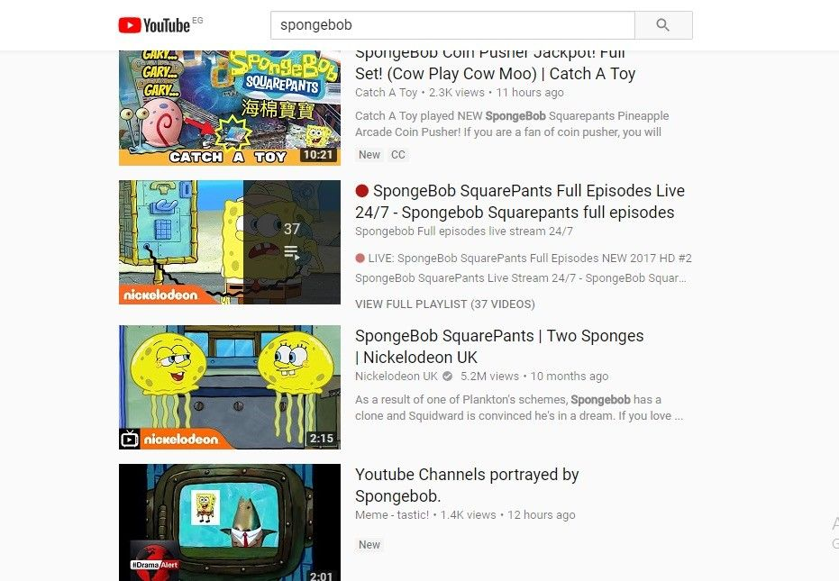

# Front-end task - YouTube

## Notes:
* Add README file with the steps of configuring your app and running it
* Use Git version to preview your project 

## Requirements:
* Create Scalable Components based on Typescript By using React
* Use React Hooks as much as possible
* Consider the project to be Scaleable
* Create responsive design
* Don't use CSS frameworks e.i. Material-UI, materialize, or Bootstrap
* Search URL /search?query={txt}

## In mobile:
* It will look like the images , has header, filters, and body
* The header contains logo search text and search icon
* When u click on the search key the search text will convert to search input 
* The loading will be like the loading in the images 

## In desktop:
* The header is fixed when scrolling
* The header has the logo and the search controllers
* The second header had the results count and the filters button
* When u search (write in textbox and press enter or click the search button) the loading bar will appear .

## Use Youtube APIs:
* The search Api Search: list  |  YouTube Data API  |  Google Developers 

## Preferred:
* Use git and make sure the commit messages make sense
* Try to use CSS and js linters be consistent in the way of writing your code
* Use state-management

## Reference

 

 

 

 

 
